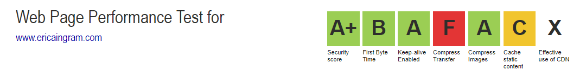
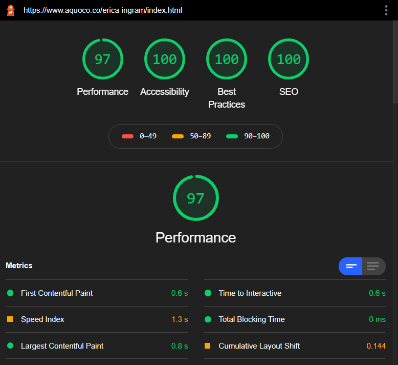
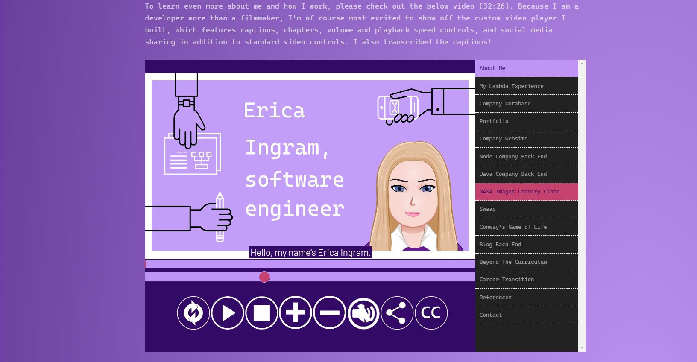
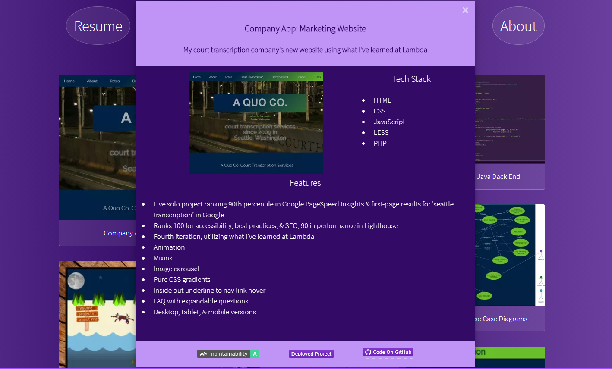

# New Portfolio Website

[Deployed Project](http://www.ericaingram.com)

## My Role

This was a solo project.

## Project Description

New portfolio website using what I've learned in Lambda and since.

Check out my project walkthrough video with custom-built video player at my [portfolio](http://www.ericaingram.com), where you can download both the video and PowerPoint presentation.  This site features an animated gradient background, Bootstrap for a wrapper, Font Awesome icons, modal for each project, and the GitHub calendar app.  It is fully responsive and has been optimized for fast loading.

## Key Features

- Live solo project
- Second iteration, utilizing what I've learned at and since Lambda
- 100/100 for accessibility, best practices, and SEO in Google Chrome's Lighthouse report
- 93/100 for performance in Google Chrome's Lighthouse report
- pure CSS gradient background
- project walkthrough video
- PowerPoint presentation
- Resume available in several formats:  markdown, PDF, and HTML
- Full-featured custom-built HTML5 video player w/ chapters, closed captioning, and share, playback speed, & volume controls in addition to standard player controls
- cohesive branding between all formats of resume, portfolio, GitHub profile readme, Twitter account, and project walkthrough video.
- performance optimizations for fast loading
- GitHub calendar app
- modal for each project
- fully responsive

## Tech Stack

Deployed to `private hosting` and built using:

- [HTML](https://en.wikipedia.org/wiki/HTML): standard markup language for documents designed to be displayed in a web browser.
- [CSS](https://developer.mozilla.org/en-US/docs/Web/CSS):  a stylesheet language used to describe the presentation of a document written in HTML or XML.
- [JavaScript](https://developer.mozilla.org/en-US/docs/Web/javascript):  a lightweight, interpreted, or just-in-time compiled programming language with first-class functions.
- [Bootstrap](https://getbootstrap.com/):  The world’s most popular front-end open source toolkit, featuring Sass variables and mixins, responsive grid system, extensive prebuilt components, and powerful JavaScript plugins.
- [Font Awesome](https://fontawesome.com/):  The web's most popular icon set and toolkit.

## Testing

This site was manually tested in Brave, Firefox, Chromium Edge, and Chrome.

## Screenshots

